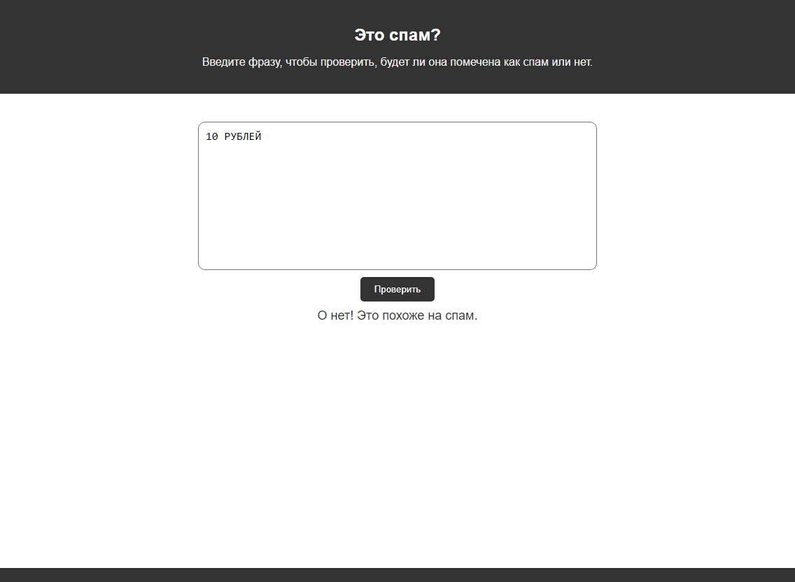

# [Спам-фильтр](https:// "Ссылка на сайт")

## Описание проекта

Эта программа - это простой спам-фильтр, написанный на JavaScript. Он проверяет введенное пользователем сообщение на наличие определенных фраз или слов, которые могут указывать на спам.  

В программе используются регулярные выражения, которые соответствуют фразам или словам, часто встречающимся в спаме.

Эти фразы включают:

    * "помогите" или "помощь"
    * любое количество цифр, за которыми следует "тысяч", "миллионов" или "миллиардов" рублей
    * слово "бесплатно"
    * фразы, начинающиеся на "скидка" и заканчивающиеся на "внимание"
    * фраза "дорогой друг"

## Скриншот работы

Здесь представлен скриншот работы программы:

